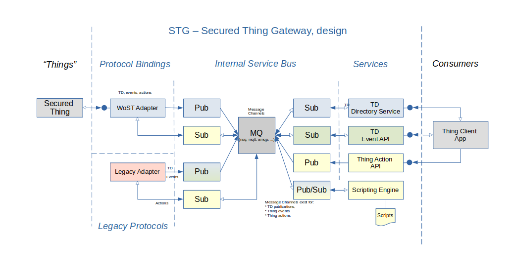

# WoST Gateway

The WoST Gateway is the reference implementation of the gateway for the Web of Secured Things. It receives information from 'WoST Things' and makes the result available to consumers. The gateway aims to be compatible with the WoT open standard but is constrainted to features that meet the WoST security mandate of "Things Do Not Run Servers".

## Project Status

Status: Alpha

The core implementation of the gateway with plugin support is feature complete. This includes a built-in message bus and the option to use MQTT as a message bus to communicate between plugins and gateway. The gateway can be started and will listen for publication and subscriptions by plugins

Next up is adding an example plugin that Secured Things can use to push their Thing Description.


## Audience

This project is aimed at software developers and system implementors with knowledge of operating systems and computing devices. 

A Binary distribution of the gateway and its plugins can be installed and used by users with basic Linux skills.

## Summary

The gateway is intended to cover various use-cases. The WoT architecture describes [several of them](https://www.w3.org/TR/wot-architecture/#sec-use-cases) such as smart home for consumers and smart factories in industry. 

The gateway is intended to be used with WoST compliant IoT devices (WoST Things)and legacy devices. WoST compliant devices automatically discovery the gateway on a local network and requests to provision themselves. The administrator logs into the gateway and accepts the provisioning request. From then on the device sends its Thing Description and its events to the gateway, from where it can be accessed and monitored. A management plugin lets the user administer and monitor devices through a web browser. 

Legacy devices that are not WoST compliant are accessed through plugins that convert between the legacy format and WoT standards. They can be used as if they are WoT devices via the gateway APIs.

In either case WoST Things are never accessed directly. WoST managed IoT devices should remain in a secured fire-walled area. End users view and control the devices through the gateway using their web browser. This works entirely stand-alone and no Internet access is required. For remote access and monitoring, the gateway can connect securely to a cloud WoST Gateway over the Internet. Here too, there is never a direct connection from the Internet to the local network.

The features of the gateway is provided through plugins. Core plugins that (will be) included are for Thing discovery using Thing Description documents. 

## WoST vs WoT

As mentioned elsewhere in more detail, WoST is an implementation of WoT where Things do not run a server. Instead WoST 'Things' push their data into an intermediary WoST gateway. The  reason behind this approach is that of security. Implementing servers securely is hard and not a role for a simple IoT device.

WoST therefore supports [section 6.7 of the WoT architecture](https://www.w3.org/TR/wot-architecture/#direct-communication) with a protocol binding that requires the Thing to connect to an Intermediary. The WoST gateway is in this case the intermediary and implements a server for the Thing to connect to. 

The WoST gateway functionality is provided through plugins. The Intermediary plugin implements the protocol binding for WoST Things to connect to.  

## Installation

The WoST Gateway is designed to run on Linux based computers. Mac, Windows and Android versions are currently not considered since the recommendation is to run it on a stand-alone computer. 

### System Requirements

Unless the gateway is provided as part of an appliance, it needs to be installed on a computer. It is best to use a dedicated computer for this. 

For home users a raspberry pi 2+ will be powerful enough to run the gateway and simple plugins. For industrial or automotive usage a dedicated embedded computer system is recommended.

In its most basic configuration the gateway needs less than 100MB of RAM and an ARMv7 CPU as found on a PI2. See plugin documentation for additional memory requirements.

### Install From Package Manager

Installation from package managers is currently not available.

### Manual Install As User

The Gateway can be installed and run as a dedicated user. 

Installation tarballs will be made available or build from source.
After untarring or building go to the 'dist' folder and copy the files to the home's bin folder.
```
mkdir ~/bin/wost
cp -a * ~/bin/wost
```
This will create the following folder structure

* /home/{user}/bin/wost/bin      gateway and plugin binaries
* /home/{user}/bin/wost/config   gateway and plugin configuration
* /home/{user}/bin/wost/logs     gateway and plugin logging output
* /home/{user}/bin/wost/certs    TLS certificates generated by the 
  

### Manual Install To System

For systemd installation, as root for user 'wost'. 
When changing the user and folders make sure to edit the wost-gateway.service file accordingly.
From the dist folder run:
```
# Create folders
mkdir /opt/wost/       
mkdir /etc/wost/       
mkdir /etc/wost/certs/ 
mkdir /var/log/wost/   

# Install WoST configuration and systemd
# unpack the tarball in a temp for and run:
sudo cp config/* /etc/wost
sudo cp init/wost-gateway.service /etc/systemd/system
sudo cp dist/bin/* /opt/wost

# Setup user and permissions
adduser --system --no-create-home --home /opt/wost --shell /usr/sbin/nologin --group wost
chown -R wost:wost /etc/wost
chown -R wost:wost /var/log/wost

systemctl daemon-reload
```

### Build From Source

To build the core and bundled plugins from source, a Linux system with golang and make tools must be available. 3rd party plugins are out of scope for these instructions and can require nodejs, python and golang.

Prerequisites:
1. Golang 1.14 or newer
2. GCC Make

Build and install from source (tentative):
```
$ git clone https://github.com/wostzone/gateway
$ make all 
```

After the build is complete, the distribution binaries can be found in the 'dist/bin' folder for 64 bit Intel CPUs and dist/arm for ARM CPUs. 

## Configuration

The gateway is configured through the 'gateway.yaml' configuration file that can be edited with a regular text editor. The sample file in the dist config folder contains configuration options with the default values.

The gateway looks in the ./config folder or the /etc/wost folder for this file. This file is optional. Out of the box defaults will provide a working gateway with an internal service bus that listens on localhost port 9678 (WOST). 

Plugins can optionally be configured through yaml configuration files in the same configuration folder.

## Launching

The gateway can be launched manually by invoking the 'gateway' app in the wost folder.
eg ~/bin/wost/bin/gateway

A systemd launcher can be configured to launch automatically on startup for Linux systems that use systemd. 

```
systemctl enable wost-gateway
systemctl start wost-gateway
```

# Design 



## Overview

The gateway consists of an internal service bus and a collection of plugins. The plugins fall into two categories, protocol bindings and services. Protocol bindings connect with Things and 3rd party IoT devices while services provide consumer side functionality such as directory services. When available the WoT specified data and API definitions are used.

All features of the gateway are provided through these plugins. Plugins can be written in any language, including ECMAScript to be compliant with the [WoT Scripting API](https://www.w3.org/TR/wot-architecture/#sec-scripting-api). It is even possible to write a plugin for plugins to support a particular programming platform such as EC6. 

As mentioned, plugins fall into two categories depending on their purpose:
* Protocol bindings provide connectivity for WoST Things and for 3rd party IoT devices. These plugins convert the device description data they receive to a Thing Description document and submit events in the WoT format according to the WoT specifications.
* Service plugins provide a service to consumer applications. They can receive requests and publish actions for Things to execute. Services can make additional API's available to consumers, for example a directory service and a web client interface. Consumers never communicate directly with Things. This always goes throught the gateway intermediary.

The gateway comes with an internal websocket based lightweight message bus for communication between plugins. A client library is provided for plugins to easily publish and subscribe to message channels. The message bus is default configured for TLS and generates its own CA, Server and Client certificates. For those that think this is overkill, TLS can be disabled by setting an empty certificate folder in the gateway.yaml configuration file. By default and when run without configuration the gateway will start the internal message bus with TLS. 

For distributed high performance use-cases the internal message bus can be replaced with a MQTT message bus such as Mosquitto. To enable this set the 'protocol' option to 'mqtt' in the configuration file, set the hostname to the address and port of the MQTT server, and copy the server public certificate to the gateway certs folder as gatewy.crt.

The included gateway client library (for use by plugins) support both the internal message bus and MQTT and uses the gateway.yaml configuration file to connect to the message bus. This allows the re-use of a plugin in places with different message bus implementations. The gateway client library will be made available for programming language such as golang, ES6, and Python. 

Plugins publish and subscribe to gateway 'channels'. Each type of data has its own channel. WoT related channel are the 'td', 'events' and 'actions' channels. That carry JSON messages in the WoT specified format. Plugins can add additional channels as needed.


### Protocol Binding Plugins

The primary role of protocol binding plugins is to translate between 3rd party  protocols and the WoT data standards. Plugins publish the TD (Thing Description) onto the 'td' channel, publish Thing events on the 'events' channel and subscribe to Thing actions on the 'actions' channel.

The format of the data pushed into the channel MUST match the schema as by the WoT [TD Schema](https://www.w3.org/TR/wot-thing-description/#json-schema-for-validation)

See the 'writing a plugin' (todo) documentation or one of the existing plugins on how to use channels to communicate with the gateway.

Plugins can publish to additional channels for extended functionality. A schema definition for the new channel must be defined and followed.


### Service Plugins

Service plugins provide their own API or run their own web server to make Thing data available to consumers. For example a directory service provides an API to query known devices. The admin plugin provides a web page to administer the gateway and its plugins. 

Service plugins subscribe to the TD and Event channels to obtain information about things and can publish actions to control Things.

Service plugins can also create a new channel to communicate with other plugins, specific to the purpose of the plugin. A schema definition for the new channel must be defined and followed.

<todo>See the list of available service plugins for details. </todo>

## Writing Plugins

Plugins can be written in any programming language. They can include a configuration file that describes their purpose and the channels they use. Plugins should use the gateway messenger library to connect to the service bus.

There is nearly no boilerplate code involved in writing plugins, except for adhering to the channel data requirements. Plugins can therefore be very simple. 

Plugins run in their own process, isolated from other plugins. It is however possible to write a plugin that launches other plugins in threads. For example, a JS plugin can load additional plugins written in Javascript. Each of the additional plugin connects to the gateway channels using the client library.

### Data Channels

Data published on WoST Gateway channels MUST adhere to that data channel's schema specification.  The Gateway has the following predefined channels:
* td: Thing descriptions https://www.w3.org/TR/2020/WD-wot-thing-description11-20201124/
* events: Thing events
* actions: Thing actions

Message published on these channel MUST adhere to the WoT data schemas for TD, events and actions.

### Plugin Configuration

Plugins are configured the same way as Things are configured. Each plugin has a TD that describes its properties, events and actions. (TODO)


### Core Plugins

The WoST project plans to include several core plugins for using the gateway out of the box. Like any other plugin, these can be replaced with an alternative implementation. The gateway.yaml configuration lists which plugins to run on startup.

* The 'intermediary' protocol binding provides an API for Things to connect to and publish their TD and events, and receive actions. It supports HTTPS and Websocket connections over TLS.

* The 'discovery' protocol binding announces the gateway intermediary on the local network using mDNS. This is intended to let WoST Things and Consumers automatically discover the gateway.

* The 'directory' service provides an HTTPS API for consumers to query discovered Things. 

* The 'forwarder' service forwards select Exposed Things to another cloud based intermediary such as another WoST gateway. Intended to safely access Things via the cloud. 

* The 'admin' plugin provides an web based administration panel to view and configure Things and plugins.

* The 'recorder' service is a simple example plugin that records channel messages into files. Intended for testing.

 lanneld protocol binding plugins:

* The 'owserver' protocol binding publishes 1-wire OwServer-V2 devices

* The 'openzwave' protocol binding publishes open-zwave devices

* The 'ipcam' protocol binding publishes network camera snapshots

* The 'isy99' protocol binding publishes ISY99 (Insteon) devices 

* The 'zigbee' protocol binding publishes zigbee devices

* The 'coap' protocol binding for CoAP IoT devices
 
Advanced plugins under consideration:

* The 'history' service plugin implements the history API to query historical values for Things. (NGSI-LD history API)

* The 'script' service plugin executes ECMA scripts. It lets script receive channel data and can execute actions. 

* The 'notification' service plugin sends messages from the notification channel to the configured destination, eg Email, SMS, other.

* The 'wallpaper' service builds a live wallpaper out of ip cameras or other published images

## Launching Plugins

Plugins are launched at startup and given the same arguments as the gateway to determine the configuration and message bus connection information:

```
-c            /path/to/gateway.yaml optional alt configuration, default is {home}/config/gateway.yaml
-home         /path/to/app/home    optional alternative application home folder/ Defa
-certsFolder  /path/to/alt/certs   optional certificate folder, eg when using mqtt. Default is {home}/certs
-configFolder /path/to/alt/config  optional alternative config, eg /etc/wost
-hostname     localhost:9678       optional alternative message bus, eg mosquitto:8883
-logFile      /path/to/gateway.log optional logfile. Use to determine logs folder
-protocol mqtt | smbus             default is smbus
-pluginFolder                      optional alt plugin folder, default is {home}/bin
-logLevel warning                  for extra logging, default is gateway loglevel
-useTLS true                       option to not use TLS, default true
```

The plugin configuration file is pluginID.yaml in the {home}/config folder. This file is optional. A default file is provided with the plugin. This file describes the plugin properties, events and actions in TD compatible format.

## Messenger Connections

After launch, plugins connect to the message bus and subscribe to channels. The default connect address for the internal service bus (smbus) is:
> wss://localhost:9678/wost

Where localhost:9678 is defined in the gateway messaging configuration. The plugin reads the gateway.yaml on startup to ensure the same messaging setup is used.

The provided client libraries implement the connection logic for the various protocols so the plugin developer only need to know the channel ID.

A plugin can implement its own connection client for publishing and subscribing. The message format for the built-in websocket message bus is: 
> {command}:{channel}:{payload}
Where command is one of 'publish', 'subscribe', 'unsubscribe', and 'receive'. See wost/gateway/src/msgbus/MsgBusClient.go for more info.

## Why A Message Bus For Plugin Communication?

Plugins publish and subscribe to messages. While there are many ways to implement a message bus, once you add the requirement to support multiple programming langes the choices are reduced to network socket type communication. There is no best solution here which is why both an internal message bus (smbus) and an external message bus (mqtt) is supported. 

One of the benefits of this approach is that plugins do not have to run on the same machine as the gateway itself. As long as it has the certificates to connect it can function just like a local plugin. This allows for specialized tasks such as image recognition to be offloaded elsewhere. 

Since security is key, both the smbus and the MQTT message bus communication MUST use TLS. The smbus authentication is provided through client side certifices. The MQTT client can use basic authentication over TLS and requires the server certificate to be available in the gateway certs folder. 


# Contributing

Contributions to WoST projects are always welcome. There are many areas where help is needed, especially with documentation and building plugins for IoT and other devices. See [CONTRIBUTING](docs/CONTRIBUTING.md) for guidelines.


# Credits

This project builds on the Web of Things (WoT) standardization by the W3C.org standards organization. For more information https://www.w3.org/WoT/

