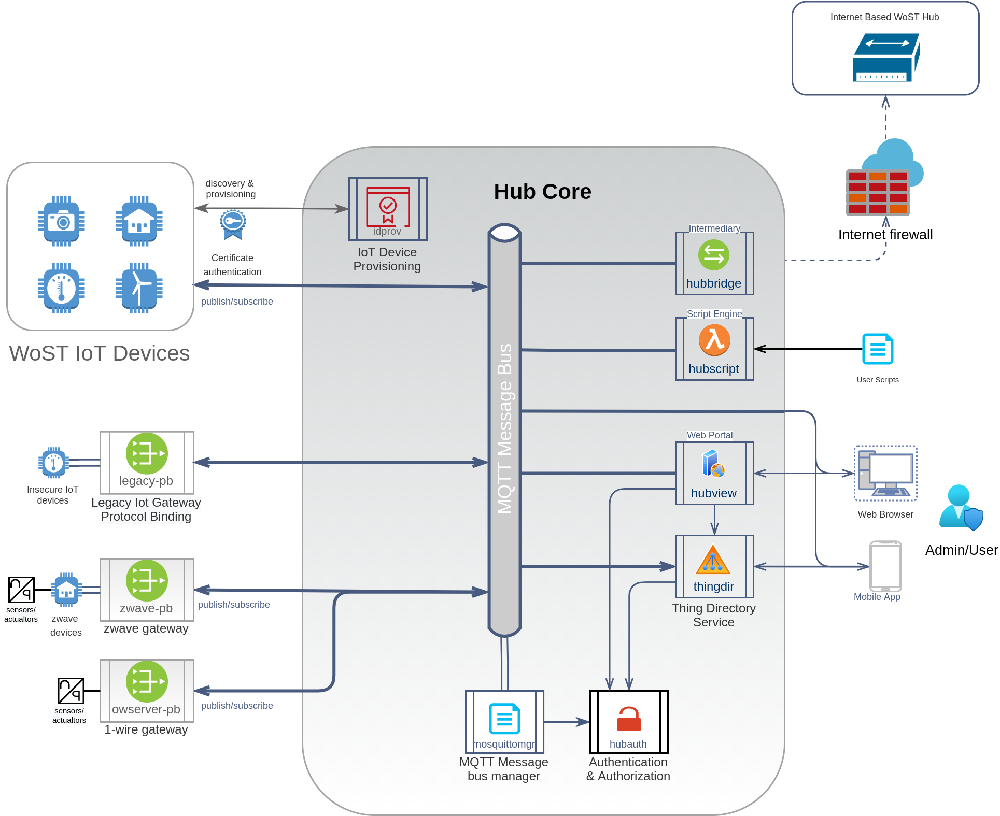

# WoST Hub

The WoST Hub is the reference implementation of the Hub for the Web of Secure Things. It acts as an intermediary between
IoT devices 'Things' and consumers. Consumers interact with Things through Hub services without connecting directly to
the Thing device. The Hub aims to be compatible with the WoT open standard but is constrainted to features that meet the
WoST security mandate of "Things Do Not Run Servers".

## Project Status

Status: The status of this plugin is Alpha. It is functional but breaking changes can be expected.

Each plugin needs to be build and installed separately, until binaries are available in the release package.

## Audience

This project is aimed at software developers and system implementors that share concerns about the security and privacy
risk of IoT devices. WoST users choose to not run servers on Things and instead use a hub and spokes model.

## Summary

The Hub module is responsible for operating Hub plugins. It purpose is to launch and monitor plugins, and report their
status. In itself it does not provide any features other than managing the plugins.

The Hub and its plugin is configured through the hub.yaml configuration file that provides default settings for its
services and which services to launch.

### Ports

The Hub includes serveral services that listen on specific ports. The default port numbers used by the hub services are:

* 8880 idprov provisioning for discovery of hub by IoT devices
* 8881 wost hub authentication service for token creation and renewal
* 8882 wost bridge for linking two hubs
* 8883 mqtt message bus, mqtt port requiring username-password authentication
* 8884 mqtt message bus, mqtt port requiring certificate authentication
* 8885 mqtt message bus, websocket port requiring username-password authentication
* 8886 thingdir thing directory service port for querying known Thing Description documents
* 8443 thingview web based thing viewer application for managing and viewing things

## Installation (draft)

The WoST Hub is designed to run on Linux based computers. It might be able to work on other platforms but at this stage
this is not tested nor a priority.

### System Requirements

It is recommended to use a dedicated linux computer for installing the Hub and its plugins. For experimental industrial
or automotive usage a dedicated embedded computer system with Intel or ARM processors is recommended. For home users a
raspberry pi 2+ will be sufficient to run the Hub and most plugins.

The minimal requirement is 100MB of RAM and an Intel Celeron, or ARMv7 CPU. Additional resources might be required for
some plugins. See plugin documentation.

The Hub requires the installation of the Mosquitto MQTT message broker. The 'mosquittomgr' plugin manages the
configuration and security of the Mosquitto broker on behalf of the Hub. Other MQTT brokers can be used instead of
mosquitto as long as they have an accompanying service to manage the configuration. The MQTT broker can but does not
have to run on the same system as the Hub.

### Install From Package Manager

Installation from package managers is currently not available.

### Install From Binary Releases

Beta and production releases will include binaries for amd64 and arm64 (pi 2-4).

Configuration of plugins is optional as all plugins run out of the box with default values. The hub.yaml configuration
is used to enable plugins. (Eventually this will be configurable via the portal.)

### Manual Install As User

The Hub can be installed and run as a dedicated user.

After obtaining the binary files they need to be copied to the WoST bin folder:

```
mkdir ~/bin/wost
cp -a * ~/bin/wost
```

This will create the following folder structure

* /home/{user}/bin/wost/bin hub and plugin binaries
* /home/{user}/bin/wost/config hub and plugin configuration
* /home/{user}/bin/wost/logs hub and plugin logging output
* /home/{user}/bin/wost/certs TLS certificates generated by the hub
* /home/{user}/bin/wost/certstore Provisioned client certificates

Generate CA, server and plugin certificates:

```bash
cd ~/bin/wost
bin/auth certbundle   
```

Mosquitto setup:

Install mosquitto:
> On Ubuntu: sudo apt install mosquitto

Note: Do not autostart or configure mosquitto. Its configuration will not be used. The 'mosquittomgr' plugins will
launch an instance with a generated configuration and dedicated authentication/authorization plugin.

### Manual Install To System (tenative)

For systemd installation to run as user 'wost'. When changing the user and folders make sure to edit the
init/wost-hub.service file accordingly. From the dist folder run:

```
# Create folders
sudo mkdir /opt/wost/       
sudo mkdir -P /etc/wost/certs/ 
sudo mkdir -P /var/lib/wost/certstore/ 
sudo mkdir /var/log/wost/   

# Install WoST configuration and systemd
# download/copy the binaries tarbapp in a temp for and run:
sudo cp config/* /etc/wost
sudo vi /etc/wost/hub.yaml    - and edit the config, log, plugin folders
sudo cp init/wost-hub.service /etc/systemd/system
sudo cp dist/bin/* /opt/wost
```

Setup user and permissions:

```
sudo adduser --system --no-create-home --home /opt/wost --shell /usr/sbin/nologin --group wost
sudo chown -R wost:wost /etc/wost
sudo chown -R wost:wost /var/log/wost
sudo chown -R wost:wost /var/lib/wost

sudo systemctl daemon-reload
```

Install mosquitto on Ubuntu but do not configure it:

```
sudo apt install mosquitto
```

Run:

```
sudo service wost-hub start
```

### Build From Source

To build the core and bundled plugins from source, a Linux system with golang and make tools must be available on the
target system. 3rd party plugins are out of scope for these instructions and can require nodejs, python and golang.

Prerequisites:

1. Golang 1.15 or newer (module support)
2. GCC Make

Build and install from source (tentative):

```
$ git clone https://github.com/wostzone/hub
$ cd hub
$ make -C core init
$ make all 
```

After the build is complete, the distribution binaries can be found in the 'dist/bin' folder. The Hub build includes the
core plugins.

To install the hub as the user:

```
make installs
```

This copies the binaries and config to the ~/bin/wost location

Additional plugins are built similarly:

```bash
$ git clone https://github.com/wostzone/{plugin}
$ cd plugin
$ make all 
$ make install                    (to install as user to ~/bin/wost/...)
```

## Configuration

The Hub will run out of the box but can be configured using the 'hub.yaml' configuration file. The sample file in the
dist/config folder contains configuration options with the default values.

The Hub looks in the {home}/config folder for hub.yaml. The file MUST exist as it contains the message bus connection
information for use by plugins. By default the host outbound IP address is used. For hosts with multiple addresses, the
address to use can be configured in hub.yaml

Plugins read the hub.yaml configuration and can have an their own plugin specific configuration file in the config
folder. Plugins must be able to run without a configuration file.

## Launching

The Hub can be launched manually by invoking the 'hub' app in the wost bin folder. eg ~/bin/wost/bin/hub. The services
to start are defined in the hub.yaml configuration file.

A systemd launcher is provided that can be configured to launch on startup for systemd compatible Linux systems. See '
init/wost.service'

```
sudo cp init/wost-hub.service /etc/systemd/system
sudo vi /etc/systmd/system/wost-hub.service      (edit user and working directory)
sudo systemctl enable wost-hub
sudo systemctl start wost-hub
```

## Plugin Installation

Plugins are installed in the Hub 'bin' directory.

After downloading or building the plugin executable:

1. Copy the plugin executable from dist/bin into the Hub binary folder.
2. Copy the plugin configuration file dist/config/{plugin}.yaml to the Hub configuration folder.
3. Enable the plugin in hub.yaml configuration file in the 'plugins' section. It will be started automatically when the
   Hub starts. Note that plugins start in the listed order.

# Design



## Overview

The Hub operates using a message bus and a curated set of plugins. The plugins fall into two categories, protocol
bindings and services. Protocol bindings connect with Things and 3rd party IoT devices while services provide consumer
side functionality such as authorization and directory services.

All services of the WoST Hub are provided through these plugins. Plugins can be written in any language. It is even
possible to write a plugin for plugins to support a particular programming platform such as EC6.

As mentioned, plugins fall into two categories depending on their primary purpose:

* Protocol bindings provide connectivity for WoST Things and legacy/3rd party IoT devices. These plugins convert the
  device description data they receive to a WoT Thing Description (TD) document and submit these onto the Hub message
  bus. Actions received from the message bus are passed back to the Thing after converting it into the Thing's native
  format.

* Service plugins provide a service to consumer applications. They can receive requests and publish actions for Things
  to execute. Services can make additional API's available to consumers, for example the directory service provides an
  API to query for Things. All communication from consumers to Things goes via Hub services.

## Hub Message Bus

Core to the Hub is its MQTT publish/subscribe message bus. Messages sent over this message bus are WoT compatible and
conform to the format defined in the [WoT TD standard](https://www.w3.org/TR/wot-thing-description/).

By default WoST uses Mosquitto as the MQTT message bus, but other implementations could be used as well. The core
mosquittomgr plugin manages the mosquitto configuration and includes a mosquitto plugin to handle authentication and
authorization. If a message bus other than mosquitto is used then a service needs to be added to manage its
configuration.

The Hub is configured with the address and ports of the message bus broker. Separate ports are used to support
authentication using client certificates, username/password authentication using the MQTT protocol, and
username/password authentication over Websockets. The ports are listed in the hub.yaml configuration file.

## Protocol Binding Plugins

Protocol Binding plugins adapt 3rd party IoT protocols to WoST Thing Description publications on the MQTT message bus.
This turns the 3rd party devices into WoST Things. For example, an openzwave protocol binding turns ZWave devices into
WoST compatible Things.

Consumers have no need to know what produces the IoT data. All they see is WoT compliant publications.

## Service Plugins

Service plugins provide their own API to the consumer. For example the core directory service plugin provides the
Directory API to query for Things.

Service plugins subscribe to TD and Event messages to obtain information about things and can publish actions to control
Things.

Core plugins included with the hub provide a works-out-of-the-box experience. Even though they are included, the use of
these plugins is optional and can be disabled in the hub.yaml configuration file.

## Writing Plugins

Plugins can be written in any programming language. The Hub provides a client library in Golang to easily connect to the
message bus. This library will be maintained along with the hub. Implementations in Python and Javascript are planned
for the future.

Plugins run in their own process, isolated from other plugins.

A [scripting API](https://www.w3.org/TR/wot-scripting-api/) is also planned and can also be used to create plugins. (
todo)

See [the documentation on writing plugins](docs/writing-plugins.md).

## Launching Plugins

Core plugins are launched at startup by the Hub and accept the Hub arguments to determine configuration files and
folders. See 'hub --help' for details. The default settings work out of the box.

Most plugins have an optional configuration file named {pluginID}.yaml in the {home}/config folder. A default file is
provided with the plugin that describes the available options.

## Client Library

The WoST project provides a [WoST client library](https://github.com/wostzone/wostlib-go). This library provides
functions for building WoST IoT clients and plugins including connections to the MQTT message bus and to construct WoT
compliant Thing Description models (TD).

IoT devices will likely also use the [provisioning client](https://github.com/wostzone/idprov-go/pkg/idprov) to
automatically discovery the provisioning server and obtain a certificate used to connect to the message bus.

Python and Javascript Hub API libraries are planned.

# Contributing

Contributions to WoST projects are always welcome. There are many areas where help is needed, especially with
documentation and building plugins for IoT and other devices. See [CONTRIBUTING](docs/CONTRIBUTING.md) for guidelines.

# Credits

This project builds on the Web of Things (WoT) standardization by the W3C.org standards organization. For more
information https://www.w3.org/WoT/
