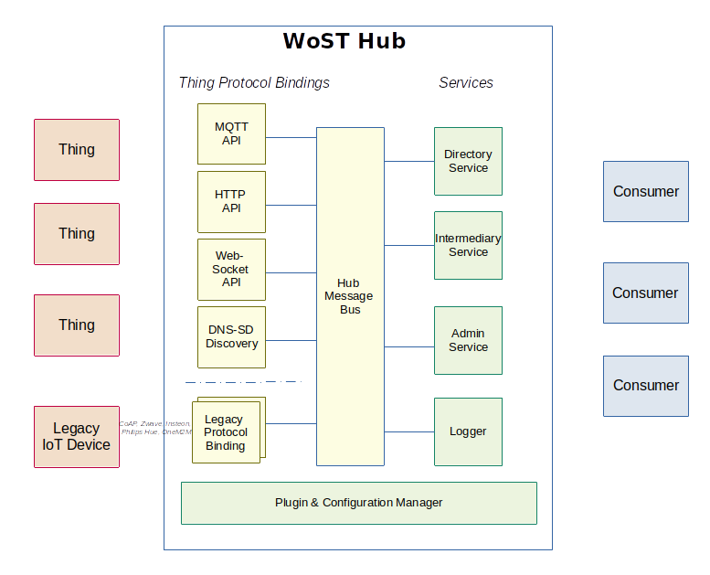

# WoST Hub

The WoST Hub is the reference implementation of the Hub for the Web of (Secured) Things. It receives information from 'Things' and provides a Thing shadow device to consumers. Consumers interact with Things through the Hub without connecting directly to the Thing. The Hub aims to be compatible with the WoT open standard but is constrainted to features that meet the WoST security mandate of "Things Do Not Run Servers".

## Project Status

Status: The status of this plugin is Alpha. It is functional but breaking changes must be expected.

Authentication and authorization improvements are in development.

## Audience

This project is aimed at software developers and system implementors that share concerns about the security and privacy risk of running a server on every WoT Thing. WoST users choose to not run servers on Things and instead use a hub and spokes model.


## Summary

The WoST Hub and plugins provide a shadow representation of discovered Things. Things register themselves with the Hub while consumers discover and control Things through the Hub. The Hub acts as an intermediary and avoids the need to provide direct access to Things by consumers. This keeps the Thing isolated and secure.

The WoST Hub is intended to be used with WoST compliant IoT devices (WoST Things)and legacy devices. WoST compliant devices can automatically discover the Hub on a local network and provision themselves with the Hub. After provisioning the device sends its Thing Description(s) and events to the Hub, from where it can be accessed and monitored. 

Legacy devices that are not WoST compliant are accessed through plugins that convert between the legacy format and WoT standards. They can be used as if they are WoT/WoST devices via the Hub APIs.

In either case WoST Things are not accessed directly. WoST managed IoT devices should remain in a secured fire-walled area. End users view and control the devices through the Hub. For use within the Local Area Network this works entirely stand-alone and no Internet access is required. For remote access and monitoring, the Hub can connect securely to a cloud based intermediary/Hub. Here too, there is never a direct connection from the Internet to the local network.

The features of the Hub is provided through plugins. Core plugins provide support for managing the message bus, Thing provisioning and service discovery. 

## WoST vs WoT

As mentioned elsewhere in more detail, WoST is an implementation of WoT with the restriction that **Things do not run a server**. Instead WoST 'Things' push their data into the WoST hub that provides intermediary services to access the Thing. The reason behind this approach is that of security. Implementing servers securely is hard and not a role for a simple IoT device.

WoST therefore supports [section 6.7 of the WoT architecture](https://www.w3.org/TR/wot-architecture/#direct-communication) with a protocol binding that requires the Thing to connect to an Intermediary. The WoST Hub is in this case the intermediary and implements a server for the Thing to connect to using one of its protocol bindings. 

## Installation

The WoST Hub is designed to run on Linux based computers.

### System Requirements

It is recommended to use a dedicated linux computer for installing the Hub and its plugins. For home users a raspberry pi 2+ will be sufficient to run the Hub and most plugins. For industrial or automotive usage a dedicated embedded computer system is recommended.

The minimal requirement is 100MB of RAM and an Intel Celeron, or ARMv7 CPU. Additional resources might be required for some plugins. See plugin documentation.

The Hub requires the installation of the Mosquitto MQTT message broker. The protocol binding pb_mosquitto plugin manages the configuration and security of the Mosquitto broker on behalf of the Hub.

### Install From Package Manager

Installation from package managers is currently not available.

### Manual Install As User

The Hub can be installed and run as a dedicated user. 

Installation tarballs will be made available or build from source.
After untarring or building go to the 'dist' folder and copy the files to the WoST bin folder.
```
mkdir ~/bin/wost
cp -a * ~/bin/wost
```
This will create the following folder structure

* /home/{user}/bin/wost/bin      hub and plugin binaries
* /home/{user}/bin/wost/config   hub and plugin configuration
* /home/{user}/bin/wost/logs     hub and plugin logging output
* /home/{user}/bin/wost/certs    TLS certificates generated by the hub

Generate certificate:
```bash
cd ~/bin/wost
bin/gencerts   
```

Mosquitto setup:

Install mosquitto: 
> On Ubuntu: sudo apt install mosquitto

Link the configuration 
> sudo ln -sf /home/{user}/bin/wost/config/wost-mosquitto.conf /etc/mosquitto/conf.d/wost-mosquitto.conf
> vi wost-mosquitto.conf 

Edit the wost-mosquitto.conf file and change the lines cafile, keyfile, certfile in the sections 'MQTT over TLS', and 'MQTT over websocket' to point to the '/home/{user}/bin/wost/certs' folder.

Enable mosquitto on startup:
> sudo systemctl enable mosquitto


### Manual Install To System (tenative)

For systemd installation, as root for user 'wost'. 
When changing the user and folders make sure to edit the wost-hub.service file accordingly.
From the dist folder run:
```
# Create folders
mkdir /opt/wost/       
mkdir /etc/wost/       
mkdir /etc/wost/certs/ 
mkdir /var/log/wost/   

# Install WoST configuration and systemd
# unpack the tarball in a temp for and run:
sudo cp config/* /etc/wost
sudo cp init/wost-hub.service /etc/systemd/system
sudo cp dist/bin/* /opt/wost

# 

# Setup user and permissions
adduser --system --no-create-home --home /opt/wost --shell /usr/sbin/nologin --group wost
chown -R wost:wost /etc/wost
chown -R wost:wost /var/log/wost

systemctl daemon-reload
```

Install mosquitto on Ubuntu:
> sudo apt install mosquitto

Link the configuration (provided by pb_mosquitto plugin)
>sudo ln -sf /etc/wost/wost-mosquitto.conf /etc/mosquitto/conf.d/wost-mosquitto.conf
>
>vi wost-mosquitto.conf 

Edit the wost-mosquitto.conf file and change the lines cafile, keyfile, certfile in the sections 'MQTT over TLS', and 'MQTT over websocket' to point to the '/etc/wost/certs' folder.

### Build From Source

To build the core and bundled plugins from source, a Linux system with golang and make tools must be available. 3rd party plugins are out of scope for these instructions and can require nodejs, python and golang.

Prerequisites:
1. Golang 1.14 or newer
2. GCC Make

Build and install from source (tentative):
```
$ git clone https://github.com/wostzone/hub
$ cd hub
$ make all 
```

After the build is complete, the distribution binaries can be found in the 'dist/bin' folder for 64 bit Intel CPUs and dist/arm for ARM CPUs. 

Plugins are built similarly. The binary should be run using the hub configuration folder:
```bash
$ git clone https://github.com/wostzone/{plugin}
$ cd plugin
$ make all 
$ cp dist/bin/* ../hub/dist/bin
$ cp dist/arm/* ../hub/dist/arm
$ cp dist/config/{plugin}.yaml ../hub/dist/config
```

## Configuration

The Hub is configured through the 'hub.yaml' configuration file that can be edited with a regular text editor. The sample file in the dist/config folder contains configuration options with the default values.

The Hub looks in the {home}/config folder or the /etc/wost folder for this file. The fule must exist as it contains the connection information for plugins and clients. The default values configure the hub for use on localhost only. Set the IP address of the message broker as Messaging address to allow LAN access.
Plugins can be configured through accompanied yaml configuration files in the same configuration folder as the hub configuration file.

## Launching

The Hub can be launched manually by invoking the 'hub' app in the wost folder.
eg ~/bin/wost/bin/hub

A systemd launcher can be configured to launch automatically on startup for Linux systems that use systemd. See 'init/wost.service'

```
sudo cp init/wost-hub.service /etc/systemd/system
sudo vi /etc/systmd/system/wost-hub.service      (edit user and working directory)
sudo systemctl enable wost-hub
sudo systemctl start wost-hub
```

## Plugin Installation

Plugins are installed in the Hub 'bin' directory.

After downloading or building the plugin executable:
1. Copy the plugin executable from dist/bin or dist/arm into the Hub binary folder.
2. Copy the plugin configuration file dist/config/{plugin}.yaml to the Hub configuration folder.  
3. Enable the plugin in hub.yaml configuration file in the 'plugins' section.It will be started automatically when the Hub starts. Note that plugins start in the listed order. 


# Design 



## Overview

The WoST Hub operates using a message bus and a curated set of plugins. The plugins fall into two categories, protocol bindings and services. Protocol bindings connect with Things and 3rd party IoT devices while services provide consumer side functionality such as directory services. When available the WoT specified data and API definitions are used.

All services of the WoST Hub are provided through these plugins. Plugins can be written in any language. It is even possible to write a plugin for plugins to support a particular programming platform such as EC6. 

As mentioned, plugins fall into two categories depending on their primary purpose:
* Protocol bindings provide connectivity for WoST Things and for legacy/3rd party IoT devices. These plugins convert the device description data they receive to a Thing Description document and submit these onto the Hub Message bus. Actions received from the message bus are passed back to the Thing after converting it into the Thing's native format. 
  
* Service plugins provide a service to consumer applications. They can receive requests and publish actions for Things to execute. Services can make additional API's available to consumers, for example a directory service can have a HTTP and a websocket API. All communication from consumers to Things goes via services. Services listen on the Message bus for thing descriptions and events and can publish actions to be performed by Things.

## Hub Message Bus

Core to the Hub is its publish/subscribe message bus. Messages sent over this message bus are WoT compatible and conform to the format defined in the [WoT TD standard](https://www.w3.org/TR/wot-thing-description/). 

By default WoST uses Mosquitto as the MQTT message bus, but other implementations could be used as well. The pb_mosquitto plugin manages the mosquitto configuration include authentication and authorization. If a message bus other than mosquitto is used, its configuration must be managed manually or a protocol adapter needs to be added to manage the configuration similar to pb_mosquitto.

The hub is configured with the address of the MQTT broker and certificate names. Plugins use this same configuration (hub.yaml) to connect to the message bus.


## Protocol Binding Plugins

Protocol Binding plugins adapt 3rd party protocols to the WoST Thing MQTT protocol. Effectively turning the 3rd party devices into WoST/WoT Things. For example, an openzwave protocol binding turns ZWave devices into WoST compatible Things.

The core protocol bindings include pb_mosquitto which manages the Mosquitto message bus configuration.

## Service Plugins

Service plugins provide their own API to the consumer. For example a directory service provides the Directory API to query for Things. The admin plugin provides a web page to administer the Hub and its plugins. 

Service plugins subscribe to TD and Event messages to obtain information about things and can publish actions to control Things.

Service plugins can also create a new channel to communicate with other plugins, specific to the purpose of the plugin. A schema definition for the new channel must be defined and followed.

<todo>See the list of available service plugins for details. </todo>

Service plugins included with the hub provide a works-out-of-the-box experience. The use of these plugins is optional. Planned plugins: 

* The 'directory' service provides an HTTPS API for consumers to query discovered Things. 

* The 'forwarder' service forwards select Exposed Things to another cloud based intermediary such as another WoST hub. Intended to safely access Things via the cloud. An authorization model determines which Things and which actions are shared with the intermediary. This is intended to provide access to Things for authorized users from over the internet without the need to open up the firewall.

* The 'logger' service is a simple example plugin that records messages into files. Intended for testing.

* The 'scripting' service provides an ECMA scripting engine to let the user run scripts. Scripts can access the message bus through the hubapi-js client library.

* The 'admin' plugin provides an web based administration panel to view and configure Things and plugins.

## Writing Plugins

Plugins can be written in any programming language by using the network interfaces. The Hub provides a messenger client library in Golang to easily connect to the message bus. This library will be maintained along with the hub. Implementations in Python and Javascript are planned for the future.

Plugins run in their own process, isolated from other plugins. 

A [scripting API](https://www.w3.org/TR/wot-scripting-api/) is also planned and  can also be used to create plugins.

See [the documentation on writing plugins](docs/writing-plugins.md). 


## Launching Plugins

Plugins are launched at startup by the Hub and given the same arguments to determine the configuration and message bus connection information:

```
-c            /path/to/hub.yaml optional alt configuration, default is {home}/config/hub.yaml
-home         /path/to/app/home    optional alternative application home folder/ Defa
-certsFolder  /path/to/alt/certs   optional certificate folder, eg when using mqtt. Default is {home}/certs
-configFolder /path/to/alt/config  optional alternative config, eg /etc/wost
-address      localhost            message bus host address
-port         8883                 port number of MQTT broker, default 8883, or 9883 for websocket
-logFile      /path/to/hub.log optional logfile. Use to determine logs folder
-logLevel warning                  for extra logging, default is hub loglevel
```

The plugin configuration file is {pluginID}.yaml in the {home}/config folder. This file is optional. A default file is provided with the plugin. This file describes the plugin properties, events and actions in TD compatible format.

## Thing APIs

The API provided by the Hub and core plugins are documented in the [Hub API module](https://github.com/wostzone/hubapi-go). This module provides a client implementation to connect to the Hub using the MQTT protocol binding.
The hubapi library also provides functions for constructing WoT compliant Thing Description models (TD).

Python and Javascript Hub API libraries are planned.


# Contributing

Contributions to WoST projects are always welcome. There are many areas where help is needed, especially with documentation and building plugins for IoT and other devices. See [CONTRIBUTING](docs/CONTRIBUTING.md) for guidelines.


# Credits

This project builds on the Web of Things (WoT) standardization by the W3C.org standards organization. For more information https://www.w3.org/WoT/
