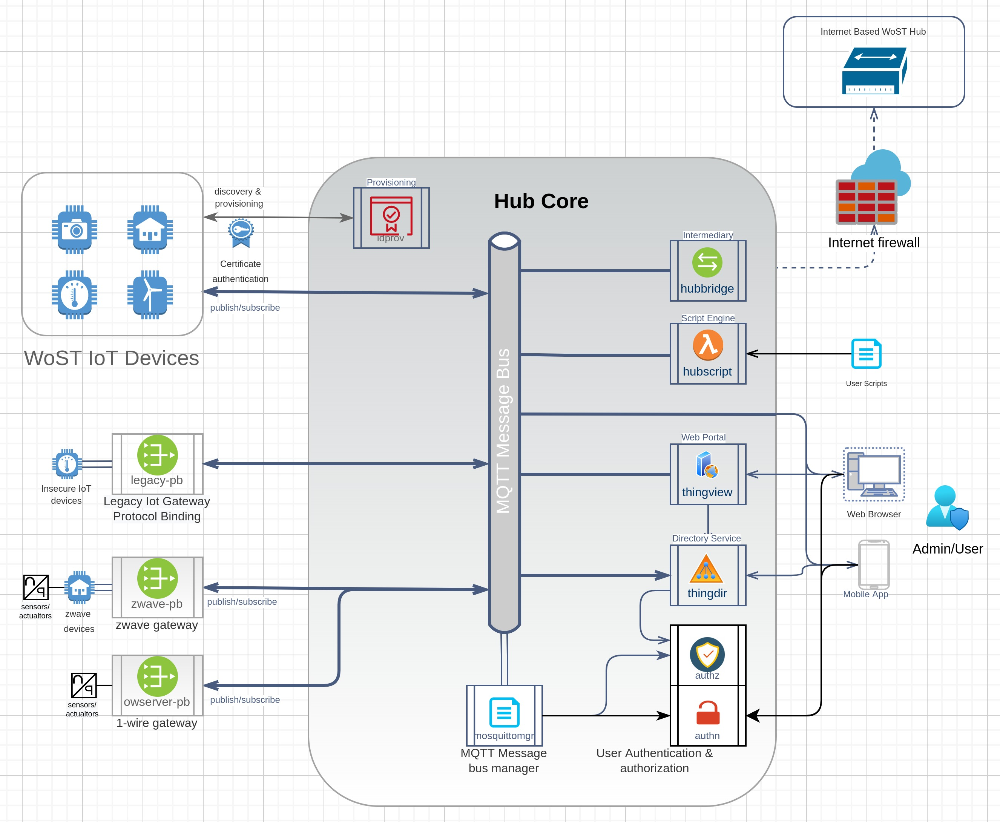

# HiveOTHub Design

## Overview

The Hub is designed following a 'hub-and-spokes' architecture. IoT devices and consumers all communicate using the Hub services. At no point do IoT devices and consumers connect to each other directly unless this is explicitly by design, like for example a media server.

The following design patterns are leveraged in the Hub:

* [Hub and Spokes with network peering](https://cloud.google.com/architecture/deploy-hub-spoke-vpc-network-topology) centralizes access to IoT devices via a central Hub. In this case the Hub itself can be distributed using network peering. This provides isolation between IoT devices, services, and consumers. As IoT devices are notoriously insecure this establishes a secure wall between them and the outside world.
* [Microservices architecture](https://docs.microsoft.com/en-us/dotnet/architecture/microservices/architect-microservice-container-applications/microservices-architecture) support the single responsibility principle, simplifies testing and reduces the risk of bugs by focusing on a single task.
* [Capabilities based security](https://en.wikipedia.org/wiki/Capability-based_security) "A capability is a communicable, unforgeable token of authority." 
* (tbd) [Sidecar pattern](https://docs.dapr.io/concepts/dapr-services/sidecar/) offloads common tasks from services to the re-usable sidecar, provides process isolation, supports heterogeneous programming languages and technologies to implement the services.
* [API Gateway pattern](https://docs.microsoft.com/en-us/dotnet/architecture/microservices/architect-microservice-container-applications/direct-client-to-microservice-communication-versus-the-api-gateway-pattern) provides a single endpoint for clients to communicate with the services instead of a separate connection to each service. This reduces coupling with the services and enables the use of middleware for common tasks such as authentication.
* [BFF design pattern](https://docs.microsoft.com/en-us/azure/architecture/patterns/backends-for-frontends) (Front For Backend Service). Dedicated services tailored to front-end usage separate the internal services API from the external API. Internal design changes do not affect the APIs and vice versa. This approach further reduces the number of request round trips as the API is tailored to the client's use-case.

Even though a distributed architecture might seem overkill for a simple solution, it opens the door to a decentralized approach where multiple computing units can provide the services without the need of a central coordinating single point of failure. Participating IoT devices can be a host to one or more service instances, increasing the capacity of the system with little hardware addition. Note that BFF services must remain isolated from the IoT devices for security reasons.

## Infrastructure

The Hub infrastructure is build on ~~[dapr](https://docs.dapr.io/concepts/building-blocks-concept/).~~ [Cap'n Proto](https://capnproto.org/)
~~Dapr manages the service to service communication, state management, pub/sub, secrets, configuration, and middleware hooks for authentication, logging, rate limiting and recovery. Lots of features in a small package. To top it off, it can run in a 'slim' lightweight container-less mode or scale out to a full-blown Kubernetes cluster.~~

### Inter-Service Communication

Hub services communicate using ~~gRPC protobuffers~~ capnproto RPC and serialization. The only exception are gateway services that use the protocol for which they are the gateway such as HTTPs.

~~Services run with their own dapr sidecar that routes incoming and outgoing communication of the service. The sidecar runs in a separate process and communicates with the service through a socket. On linux systems this can be a linux domain socket or a regular TCP port.~~

~~The Hub launcher starts a service with dapr sidecar, providing both with an app-id, connection port and the grpc or http protocol to use. For another service to invoke a method of the service, it makes a gRPC call including the app-id of the remote service. Dapr sidecar figures out where the service lives and passes it on, logs and traces the call.~~

~~If the service call fails for any reason, the sidecar attempts to recover by retrying or, if available, switching to another provider of the service.~~

### API Gateway Communication

External consumer to Hub service communication takes place using gateway endpoints. A gateway endpoint implements a connection endpoint using a specific protocol. The Hub initially comes with the HTTPS endpoint that provides external HTTPS access to gateway services. Additional endpoints can be gRPC, MQTT and others.

Gateway services bind to gateway endpoints and implement specific APIs for use by consumers. This follows the [BFF design pattern](https://docs.microsoft.com/en-us/azure/architecture/patterns/backends-for-frontends). For example:

* Directory gateway service implements an HTTP API for directory queries using the internal directory services
* Event gateway service implements a Websocket API for receiving events
* MQTT gateway service implements a MQTT API for receiving events over MQTT
* Provisioning Service API. This API serves to provision IoT devices using an out-of-bounds secret exchange to verify the identity during provisioning. It provides a client certificate for use by IoT devices to exchange Thing information.

### IoT Protocol Binding Communication

Communication with IoT devices or services take place through IoT protocol binding services. PB services provide a gateway to 3rd party protocols and allows the Hub to communicate with any IoT device.

An IoT device or service is the host for one or more 'Things'. A Thing can be a physical sensor or actuator, or a virtual sensor like the weather forecast provided by a cloud service.

PB Services are provided through plugins that can be enabled by the administrator. Each PB Service:

* Create a 'TD' Thing Description document for each 'Thing' reachable through its protocol.
* Send events when Thing properties or outputs change value.
* Pass on actions requested via the Hub to the Thing's IoT device

~~PB Services implement the ~~gRPC~~ PB pub/sub API which defines the TD, Events and Actions as defined by the W3C WoT working group. This API has 3 main methods: Publish TD, Publish Event and Subscribe to Actions.~~

~~PB Services are provided as plugins and are managed through the launcher service. Like any other service they are started with a dapr sidecar and have access to a state, secrets, and configuration store.~~

### IoT Device Communication

IoT devices or services that are HiveOT compatible can directly communicate with the Hub without the need of for a protocol binding. The API gateway provides a set of services to work with these devices/services:

1. Provisioning process
    1. The administrator provides a list of pre-approved devices and their secrets
    2. An IoT device can submit a provisioning request with or without an OOB (out of band) secret
    3. The administrator can view a list of provisioning requests for approval
    4. The administrator can approve a request
    5. An IoT device receives provisioning approval along with a signed certificate used for secure machine-to-machine communication.
2. IoT device publishes one or more TDs of Things available through the device
3. IoT device publishes an event when Thing properties or output values change
4. IoT device receives a request for action

The difference between IoT device communication and protocol bindings is that IoT devices need provisioning approval before being accepted, and they communicate via the API gateway instead of directly with internal services.

### Hub Message Bus

~~The Hub utilizes dapr's pub/sub capability to publish messages to subscribers. Dapr supports various implementations including Redis, MQTT (Mosquitto), AMQP (RabbitMQ), Azure Service Bus, Google Cloud pub/sub and NATS streaming. By default Dapr is configured to use MongoDB.~~

The pub/sub is intended for internal use but can be connected to via API gateway services. Some rules around the use of the internal pub/sub are needed for this integration to work:

* All updates to TDs are published on 'things/{id}/td'
* All events send by Things are published on 'things/{id}/event/{name}'
* All actions send to Things are published on 'things/{id}/action/{name}'

### Intermittent Connectivity

A limitation of network devices is that they only communicate when awake and connected. Battery operated devices might spend most of their time asleep while remote devices might suffer from intermittent connectivity.

HiveOT detects device connectivity and updates the status accordingly. On reconnect the device will receive queued any actions. IoT devices will have to queue their outgoing messages when disconnected, and send them when connection is reestablished.

## Plugins

Hub functionality is provided through core services and services provided through plugins. The only difference is that core services are enabled out of the box while plugin services are add-ons are enabled as needed.

~~Each service is started with a dapr sidecar for infrastructure access. This provides the service with named access to other services, state storage, event pub/sub and use of actors.~~

Service plugins can be written in any programming language. ~~The dapr SDK provides API's to access state storage and event pub/sub. Invocation of other services is done through gRPC using their protobuf APIs.~~

### Core Service Methods

An abstract of Hub services that provide the core functions of the Hub. See the Hub proto folder for more details:

* authentication services manages users and secrets
    * add user
    * remove user
    * set password
    * ~~obtain auth token (tbd, dapr middleware?)~~
    * ~~refresh auth token  (tbd, dapr middleware?)~~
* provisioning services for compatible IOT devices
    * set pre-approved OOB provisioning secrets
    * get device provisioning status
    * get list of provisioned devices
    * verify OOB secret
    * set provisioning status to requested
    * set provisioning status to approved
    * create device certificate
* discovery service
    * announce Hub discovery with its API gateway address
    * enable/disable discovery
* authorization services manages groups of users and things
    * create group
    * delete group
    * add user to group with role
    * remove user from group
    * add Thing to group
    * remove Thing from group
    * list groups
    * get group content
    * query groups a user is a member of
    * query groups a thing is a member of
* directory services keep an inventory of available Things
    * update a TD
    * remove a TD
    * list TDs
    * query TDs by type
* history services store Events and Actions, eg the input and output values of IoT Things
    * add an event
    * add an action
    * list events by Thing and date range
    * list actions by Thing and date range
    * query events
    * query actions

## Launching Services

Services are launched at startup by the Hub launcher. As the Hub supports distributed services out of the box it is possible to launch services on multiple hosts independently.

It is also possible to make services available on multiple hosts. They can be invoked in a round-robin fashion or can be constrained local usage with remote as a failover.

## Client Library For Developing IoT Devices And Consumers

HiveOT compatible IoT devices must support at least one of the message bus protocols. Currently only the MQTT protocol is used but more options can be added in the future.

The project provides a [Hub client library for developing IoT devices](https://github.com/hiveot/hub/lib/client) and their consumers. This library provides an implementation of a subset of the [Exposed Thing](https://www.w3.org/TR/wot-scripting-api/#the-exposedthing-interface) and [Consumed Thing](https://www.w3.org/TR/wot-scripting-api/#the-consumedthing-interface) interface with a protocol binding for the message bus. In addition methods to construct WoT compliant Thing Description
documents (TD) are included.

IoT devices will likely also use the [provisioning protocol client](https://github.com/hiveot/hub/idprov/pkg/idprov) to automatically discovery the provisioning server and obtain a certificate used to connect to the message bus.

The above library is written in Golang. Python and Javascript Hub API libraries are planned. They will be added to https://github.com/hiveot/lib/{python}|{js}|{...}
